# C00 · Lo construido junto a su maqueta

Cada pantalla, con la maqueta a la izquierda y la captura a la derecha. Las capturas salen solas del e2e de staging-conta, en cada ejecución (`tests/e2e/conta/c00/`), con los datos de prueba de la cuenta A (o B donde se dice). Debajo de cada pareja, **las diferencias, una a una, y por qué**.

Dos cosas que salen en todas las capturas y no son de la pantalla:
- **La franja amarilla «BUILD LOCAL · NO ES PRODUCCIÓN».** Solo existe en el build contra staging-conta.
- **La barra «Pregunta o pide algo» o la barra inferior a media página.** Son piezas fijas, y la captura es de página entera. Que no tapan nada lo mide `loQueTapan`, con la página cargada, quieta y bajada del todo.

Además, **las cifras dependen de los datos de prueba, no del diseño**: el número de proveedores, los meses cerrados y los socios. La maqueta pinta un negocio con meses de uso; staging, uno de prueba.

---

## Alta · pantalla completa, la primera empresa (N1b, respuesta 3)

| Maqueta | Captura (cuenta C, sin ninguna empresa) |
|---|---|
| 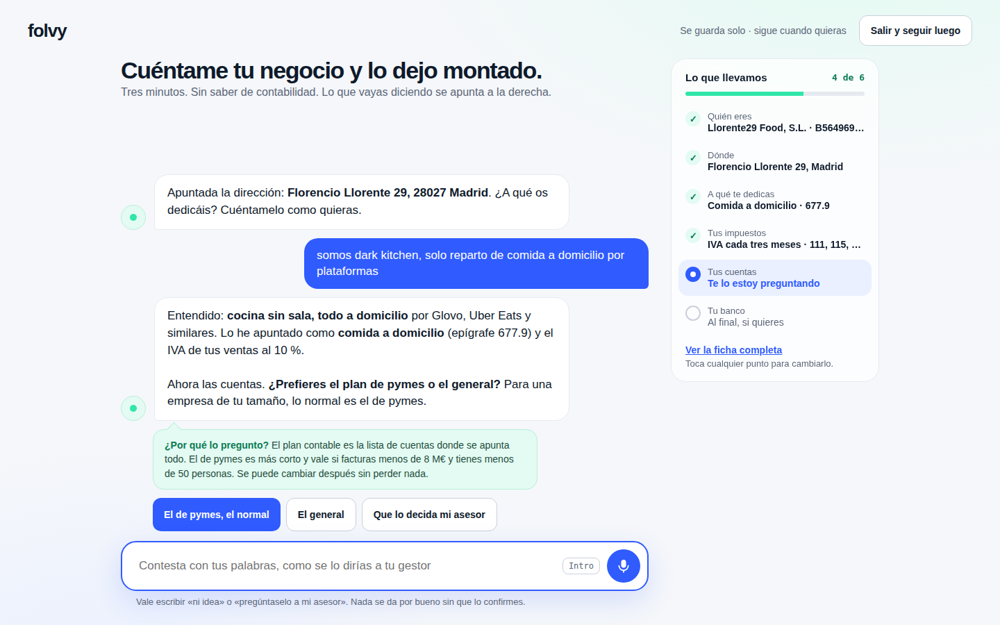 | 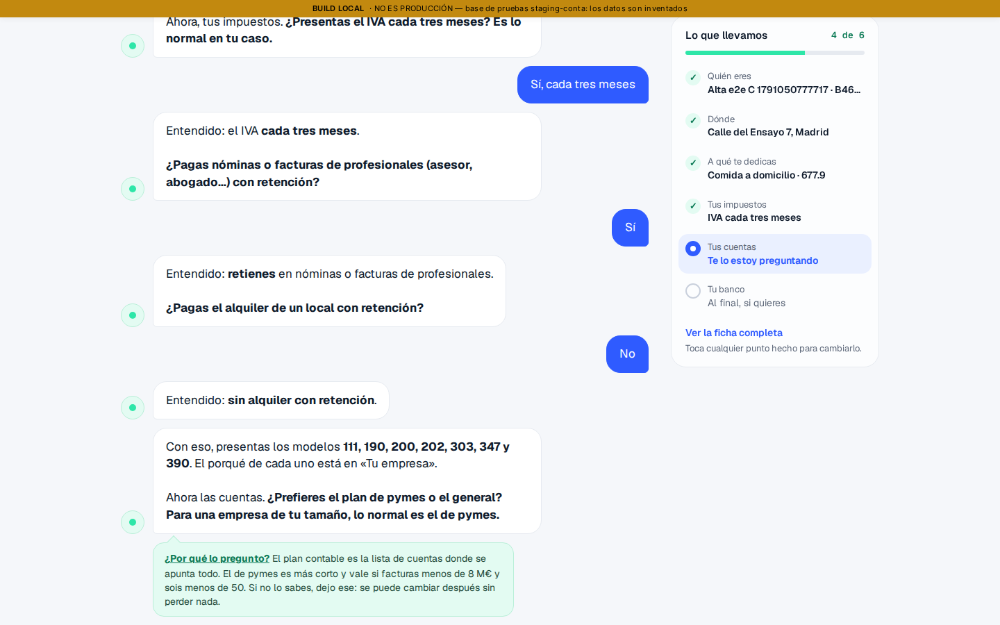 |

1. **La pantalla no hace scroll, la conversación sí.** El titular se queda arriba y la caja de escribir, abajo, como en la maqueta. La prueba llega a «Tus cuentas» escribiendo y contestando, así que hay más conversación que en la maqueta.
2. **Las preguntas ya contestadas se quedan en la conversación, cada una con lo que la IA apuntó delante.** En la maqueta, con dos respuestas, no se nota.
3. **«Tus impuestos» dice «IVA cada tres meses» sin los modelos.** Los modelos se guardan al terminar el paso y la captura es justo antes. Se ven en la del móvil y en «Tu empresa».
4. **El bocadillo «¿Por qué lo pregunto?» sale plegado y se abre al tocarlo.** La captura lo tiene abierto, como la maqueta.
5. **El texto del bocadillo de las cuentas añade «Si no lo sabes, dejo ese».** Lo pide la respuesta: qué pasa si no lo sabes.
6. **Los modelos que dice son 111, 190, 200, 202, 303, 347 y 390.** Son los anuales del punto 2. La maqueta, de antes, pone 111, 115, 202 y 303.
7. **La caja lleva botón de enviar (respuesta 4), y la maqueta no.** Es una flecha de 48 px, azul `#2F5BFF`, a la izquierda del micro. Está gris y apagada sin texto y se enciende al escribir. El micro se queda. **La maqueta N1b cambia en esto**: fue un fallo de la maqueta, que solo tenía micro. Intro envía, y la etiqueta «Intro» no se selecciona; tocarla también envía.
8. **«↵ Intro» solo con texto escrito, en azul suave (respuesta 5).** Lleva fondo `#EAF0FF` y texto `#2F5BFF`. Con la caja vacía solo están la flecha gris y el micro; al escribir salen «↵ Intro» y la flecha azul.

   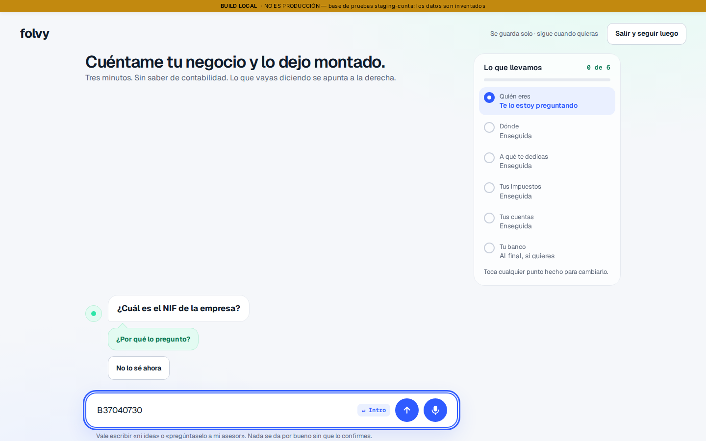

### La dirección con la población puesta por el código postal (respuesta 4, arreglo 3)

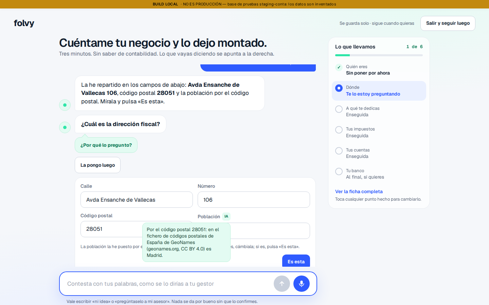

La frase de Julio, «Avda Ensanche de Vallecas 106, 28051», escrita en la caja y repartida en los campos. La población, **Madrid**, sale del código postal (tabla `postal_code_place`, GeoNames, CC BY 4.0) con su marca «IA» abierta: el porqué tapa el campo, que dice «Madrid» (la prueba lo comprueba, y que en la base queda puesta por la IA con ese porqué). «Es esta» la confirma. No hay maqueta de este paso.

## Alta · ventana flotante, otra empresa (N1c, respuesta 3)

| Maqueta | Captura (cuenta A, que ya tiene la suya) |
|---|---|
| 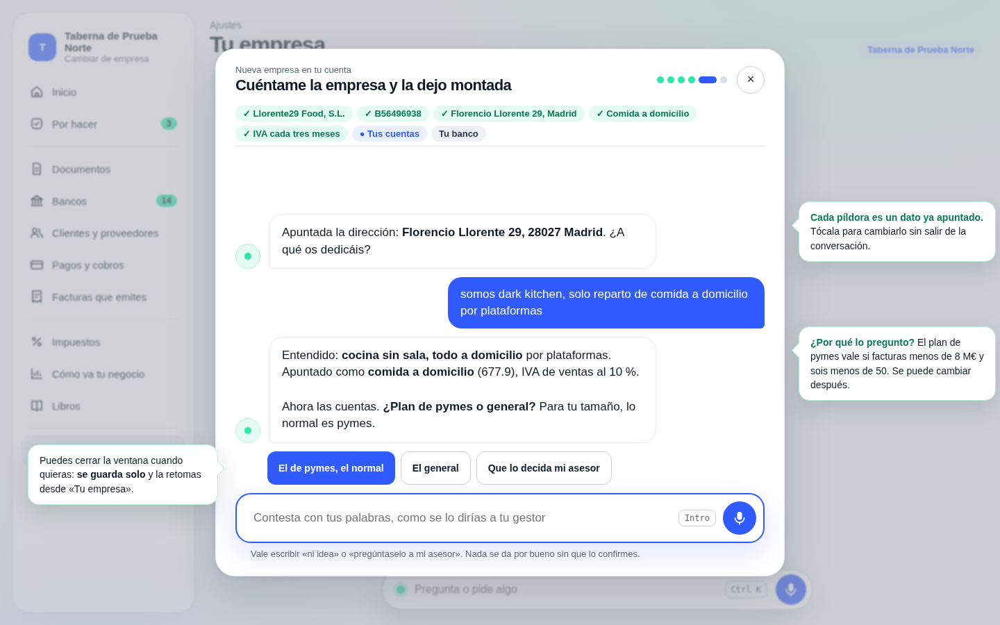 | 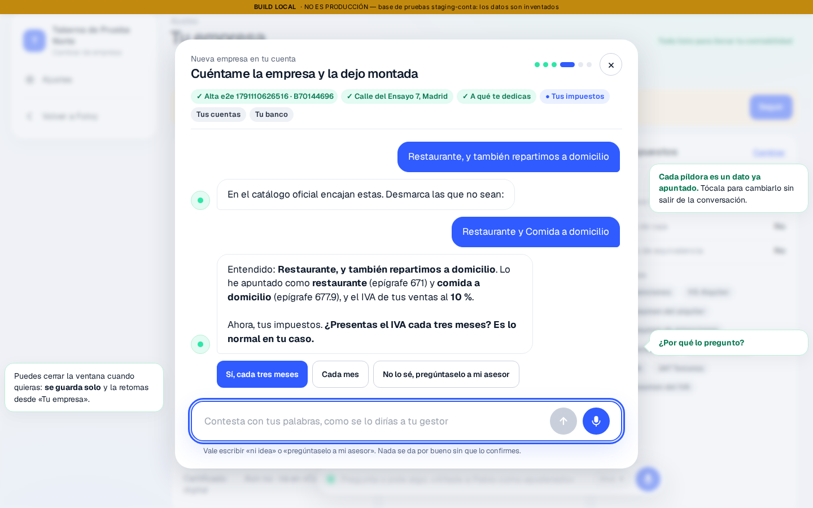 |

1. **Una píldora por punto** («✓ Alta e2e… · B…», «✓ Calle del Ensayo 7, Madrid»). La maqueta separa el nombre y el NIF en dos.
2. **«A qué te dedicas» sale con su nombre y sin su valor en el instante de la captura**: la actividad acaba de guardarse y se está releyendo. Un segundo después dice «Restaurante · 671 y 1 más».
3. **Las dos notas de fuera** («Cada píldora…» y «Puedes cerrar la ventana…») salen desde 1440 px, que es el ancho de la maqueta. Más estrecho, no caben y no salen. El bocadillo del porqué, que sí es de la pregunta, vuelve entonces dentro.
4. **Cerrar es la «×», y también Escape.** Las dos dejan en «Tu empresa» el aviso «Alta a medias · N de 6 · Seguir».
5. **El mismo botón de enviar que en N1b (respuesta 4).** La maqueta N1c tampoco lo tenía: **cambia en esto**.

## Alta · móvil (M1, adaptada a la respuesta 3)

| Conversación | «Lo que llevamos», la hoja |
|---|---|
| 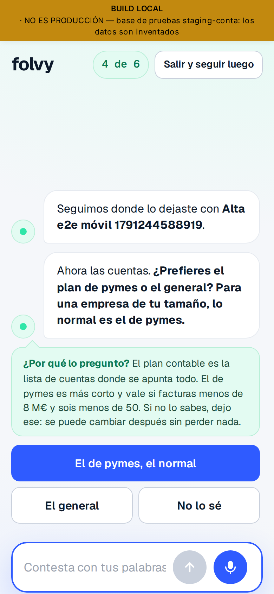 | 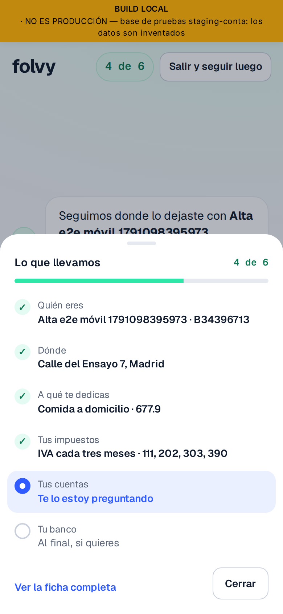 |

1. **A pantalla completa; «4 de 6» arriba sube la hoja.** No hay maqueta nueva: la respuesta dice que M1 se adapta a esto.
2. **«Salir y seguir luego» también en el móvil.**
3. **Desde la hoja también se vuelve a un punto**: se toca y la hoja se cierra en esa pregunta.
4. **Enviar también en el móvil (respuesta 4)**, a la izquierda del micro. La etiqueta «Intro» no sale: el teclado del móvil ya trae su tecla, y la prueba envía con ella.

## Tu empresa · «Para presentar el 200 y depositar las cuentas» (respuesta 3, punto 5)

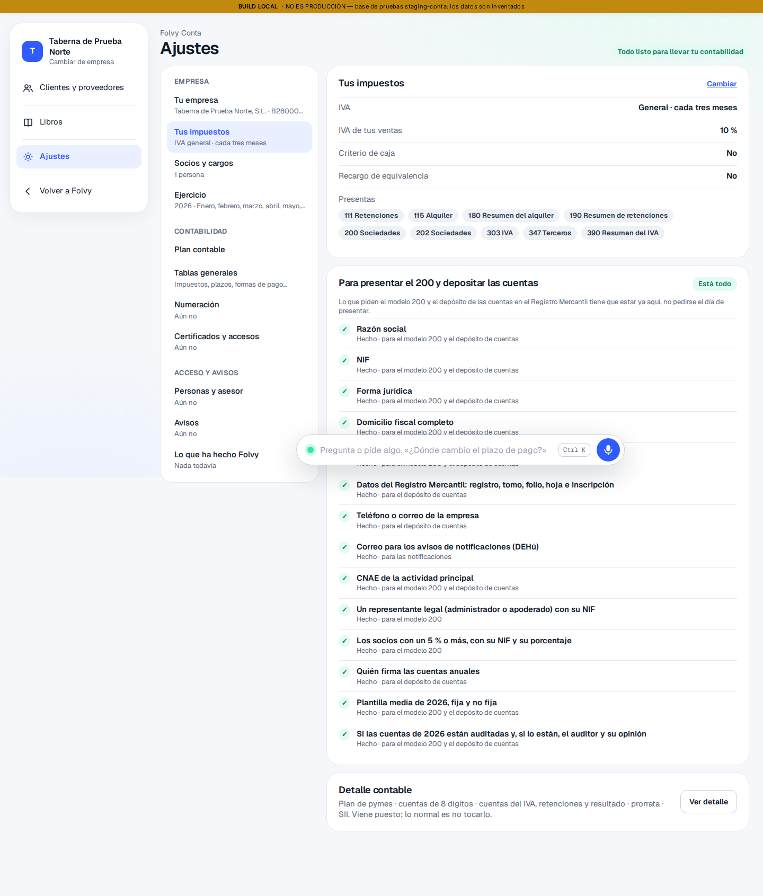

No tiene maqueta: lo pide la respuesta. Lo que piden el 200 y el depósito, uno a uno, con ✓ o «falta» y dónde se pone. El cruce está en [`C00_ficha_vs_modelos.md`](../../C00_ficha_vs_modelos.md).
- **A la Taberna le falta la forma jurídica de verdad.** El «Tipo: Sociedad» de «Quién eres» sale del tipo de NIF; el código de forma jurídica está vacío.
- **El certificado digital sale como hueco**: «Aún no · irá en «Certificados y accesos»».
- La franja amarilla y la barra de la IA a media página son las de siempre: la captura es de página entera.

## Tu empresa · ordenador (N2)

| Maqueta | Captura |
|---|---|
| 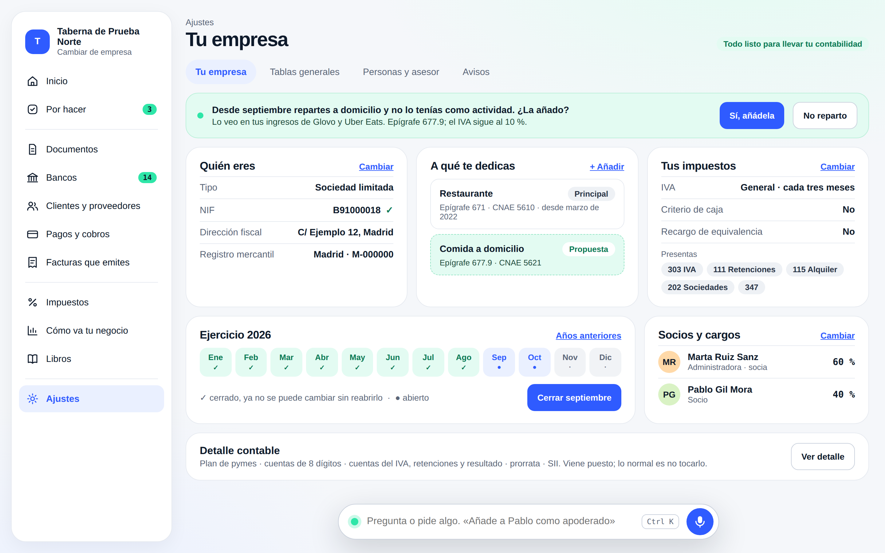 | 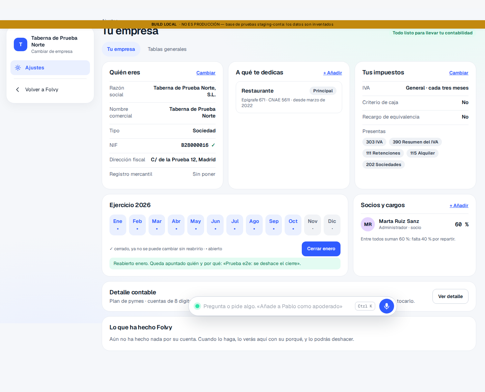 |

1. **El menú solo enseña «Ajustes» y «Volver a Folvy».** El encargo manda no enseñar las entradas que aún no tienen pantalla. «Volver a Folvy» no está en la maqueta: sin él no se sale del módulo.
2. **Faltan las pestañas «Personas y asesor» y «Avisos»**, por lo mismo.
3. **No está la sugerencia «Desde septiembre repartes a domicilio…» ni la actividad «Propuesta».** Necesitan las ventas de Cocina, y contabilidad no lee de Cocina. La sugerencia que sí existe (el modelo 115) se ve en [ia-sugerencia.png](ia-sugerencia.png).
4. **«Quién eres» enseña también la razón social y el nombre comercial.** Se cambian aquí; en la maqueta solo salen en el menú.
5. **CNAE 5611, no 5610.** La maqueta usa la CNAE-2009; la vigente es la CNAE-2025 (está en «Norma»).
6. **«Socios y cargos» lleva «+ Añadir»** y dice cuánto falta por repartir si no suman 100 %.
7. **Sin «Años anteriores».** Con un solo ejercicio abierto no hay años anteriores que enseñar.
8. **Abajo, «Lo que ha hecho Folvy»**: el registro de la IA con su deshacer (tarea 6, §6.3). La maqueta no lo dibuja. Ver [ia-registro.png](ia-registro.png).

## Tu empresa · móvil (M2)

| Maqueta | Captura |
|---|---|
| 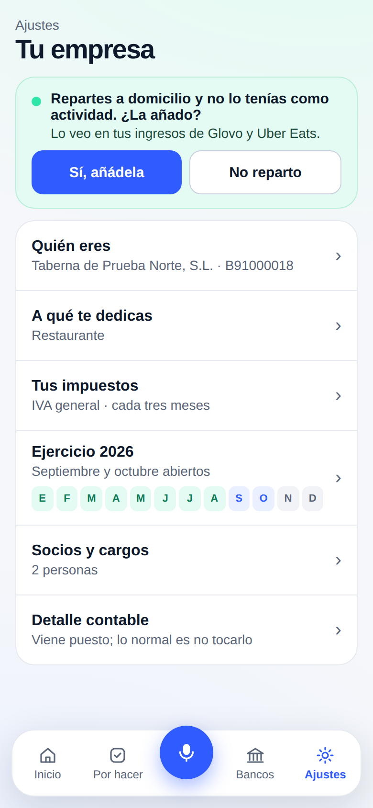 | 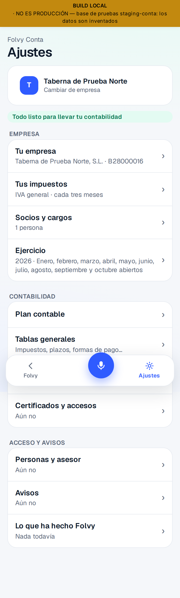 |

1. **Las pestañas «Tu empresa · Tablas generales».** M2 no las dibuja, y sin ellas no se llega a las tablas desde el móvil.
2. **«Todo listo para llevar tu contabilidad» también en el móvil.** Si falta algo, dice qué.
3. **La barra inferior lleva «Folvy» y «Ajustes».** «Inicio», «Por hacer» y «Bancos» aún no tienen pantalla.
4. **La fila «Lo que ha hecho Folvy»**, como en el ordenador.
5. **Con más de una empresa, arriba sale «Cambiar de empresa»**: la misma cabecera que el menú del ordenador. M2 dibuja una sola empresa, y la barra inferior no tiene sitio para eso. Con una empresa no sale nada. *(Añadido en la tarea 8.)*

## Tablas generales · ordenador (N3)

| Maqueta | Captura |
|---|---|
| 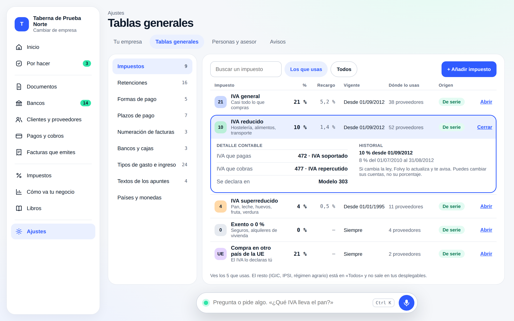 | 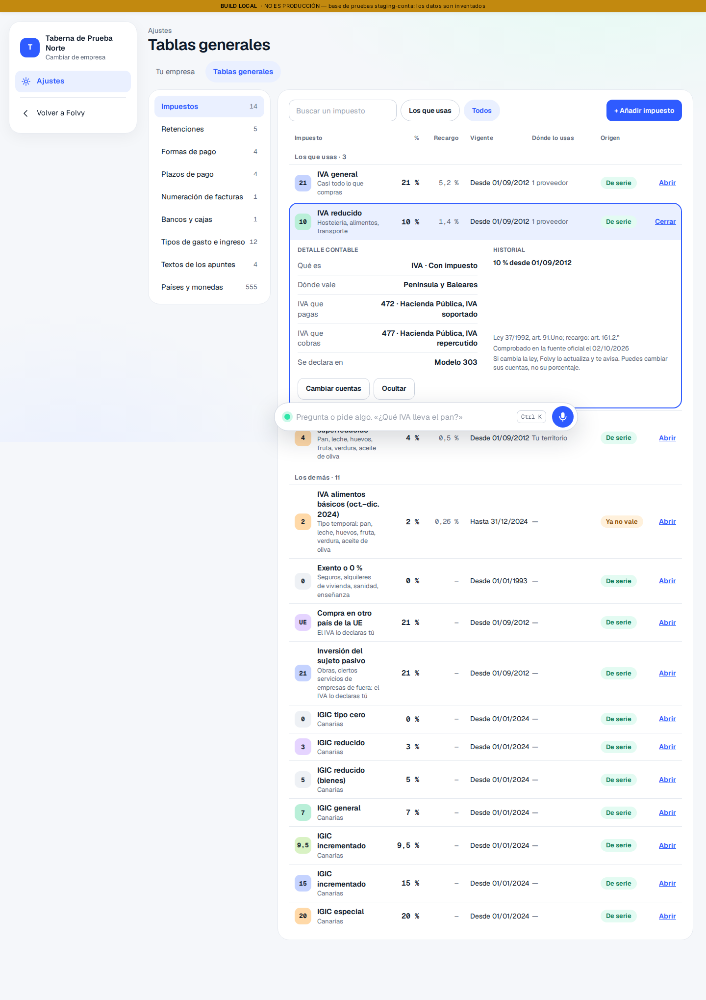 |

1. **Abre con todas las filas**: «Los que usas» arriba y «Los demás» debajo, con la separación a la vista. La maqueta acota a las que usas y lo confiesa en una nota al pie («El resto… está en «Todos»»). Lo pide D5 y la regla 7: un filtro que necesita esa nota está en el sitio equivocado.
2. **El historial del IVA reducido no trae el 8 % de 2010–2012.** El histórico anterior a 2012 no está cargado (pendiente en el PR).
3. **El detalle añade «Qué es», «Dónde vale», la norma y cuándo se comprobó.** Abajo, «Cambiar cuentas» y «Ocultar»: de una fila de serie solo se cambian las cuentas.
4. **«Superreducido, desde 01/09/2012».** Es la redacción vigente que trae la fuente; la maqueta pone 1995.

## Tablas generales · móvil (M3)

| Maqueta | Captura |
|---|---|
| 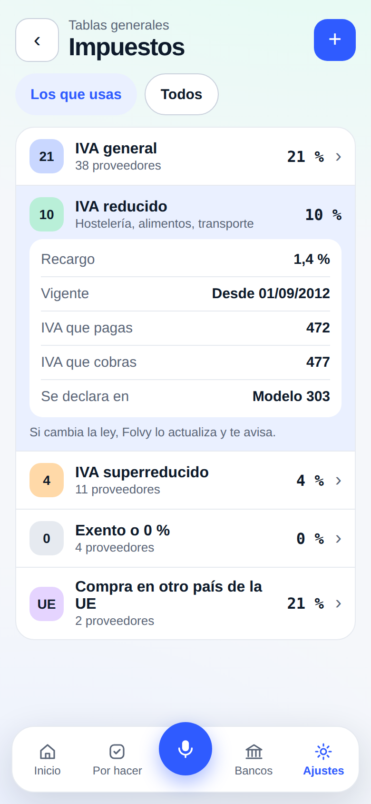 | 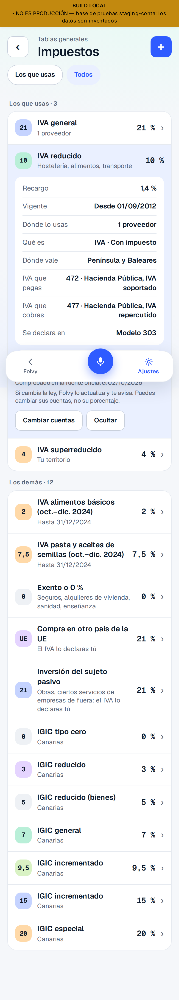 |

Las mismas diferencias que en N3: todas las filas, en dos grupos. La cuenta B, en Canarias, sube el IGIC a «Los que usas»: [tablas-b-canarias.png](tablas-b-canarias.png).

## El marco del módulo (Estilo) · cuenta B

| Ordenador | Móvil |
|---|---|
| 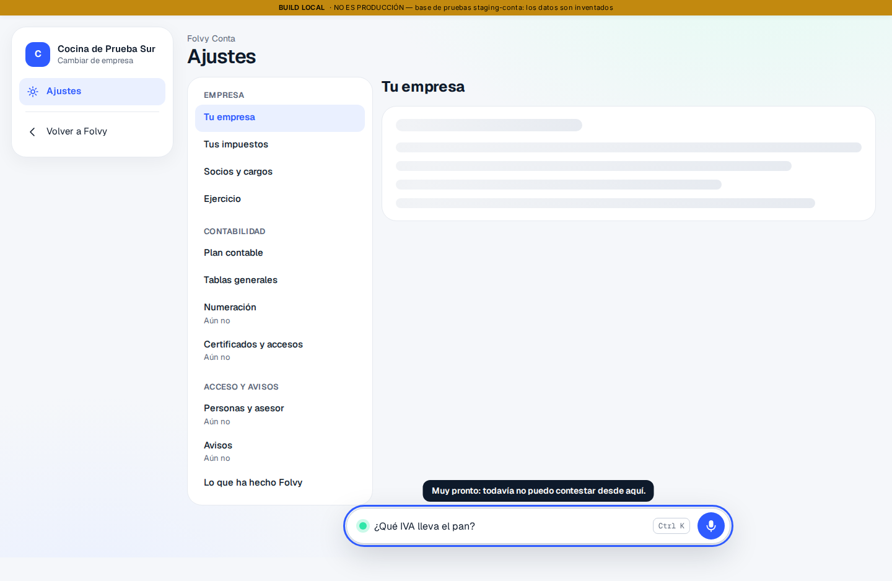 | 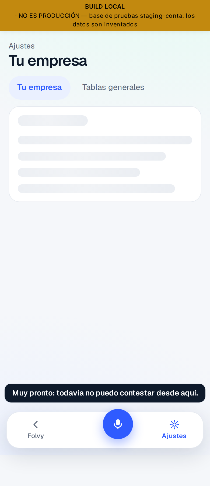 |

La cuenta B no tiene el interruptor `conta` ni los módulos de Cocina, y el módulo funciona solo. La barra «Pregunta o pide algo» y la voz contestan «Muy pronto» (§6.5).

## Ficha de proveedor (N4)

No se construye en este encargo. **Desde la respuesta 7, la ficha nueva tampoco va en este PR**: se separó al C01 (#137) para que Foodint quede exactamente como hoy. Cocina › Proveedores es la pantalla de siempre. Sus capturas son las del C01 (`docs/conta/capturas/`).
