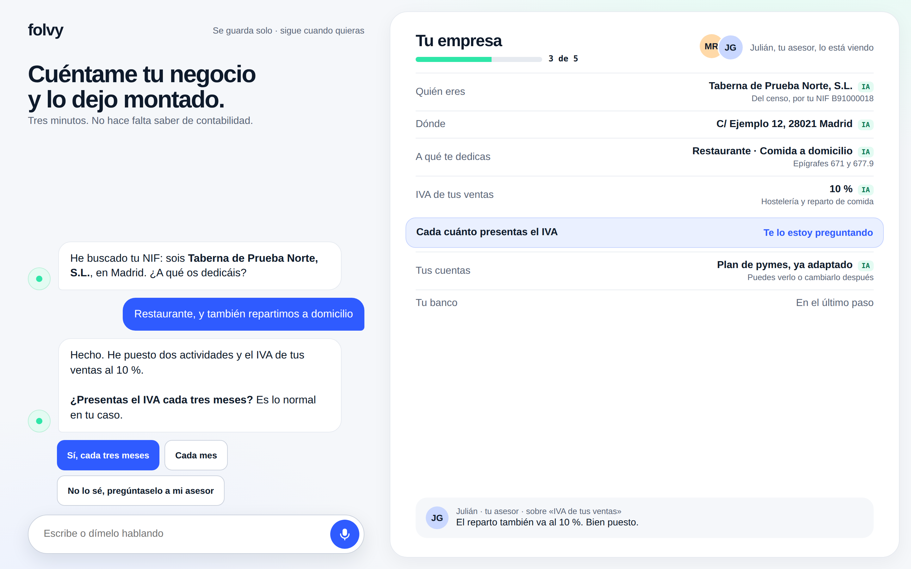
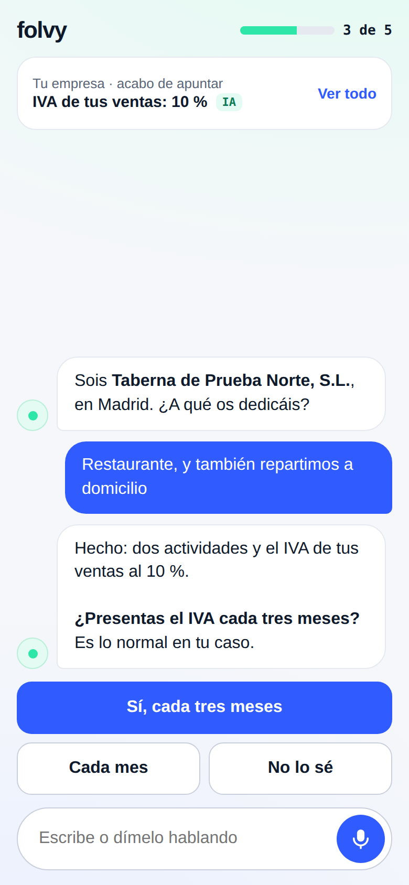

# C00 · Lo construido junto a su maqueta

Cada pantalla, con la maqueta a la izquierda y la captura a la derecha. Las capturas salen solas del e2e de staging-conta, en cada ejecución (`tests/e2e/conta/c00/`), con los datos de prueba de la cuenta A (o B donde se dice). Debajo de cada pareja, **las diferencias, una a una, y por qué**.

Dos cosas que salen en todas las capturas y no son de la pantalla:
- **La franja amarilla «BUILD LOCAL · NO ES PRODUCCIÓN».** Solo existe en el build contra staging-conta.
- **La barra «Pregunta o pide algo» o la barra inferior a media página.** Son piezas fijas, y la captura es de página entera. Que no tapan nada lo mide `loQueTapan`, con la página cargada, quieta y bajada del todo.

Además, **las cifras dependen de los datos de prueba, no del diseño**: el número de proveedores, los meses cerrados y los socios. La maqueta pinta un negocio con meses de uso; staging, uno de prueba.

---

## Alta conversada · ordenador (N1)

| Maqueta | Captura |
|---|---|
|  |  |

1. **No se consulta el censo por el NIF**, así que el nombre y la dirección se preguntan. La maqueta los saca del censo («Del censo, por tu NIF») con la marca IA. Un proveedor de pago que dé la razón social por el NIF está pendiente (D3). Lo que escribe la persona no lleva marca: no lo puso la IA.
2. **Falta la fila «IVA de tus ventas · 10 %».** El ticket al 10 % está como pregunta en la sección «Norma» del PR (bebidas alcohólicas, reparto a domicilio). No se pone un tipo de venta hasta tener la respuesta.
3. **No sale el asesor** («Julián, tu asesor, lo está viendo» y su comentario). D4: sin asesor en el alta.
4. **El titular «Cuéntame tu negocio…» se recoge al empezar.** Sin censo la conversación tiene tres preguntas más, y el titular se comería la pantalla.
5. **«Tus cuentas» sale como «Enseguida»** hasta su paso, en lugar de «Plan de pymes, ya adaptado». Se pone en su paso, con su marca.

## Alta conversada · móvil (M1)

| Maqueta | Captura |
|---|---|
|  |  |

1. **La tarjeta de arriba dice lo último que apuntó** («Añadió la actividad «Comida a domicilio»», con su marca), como M1. Lo que apunta es otra cosa, por la diferencia 2 de N1.
2. **«Cada mes» y «No lo sé» van en dos columnas**, como M1. El botón dice «No lo sé» y la frase entera va en su etiqueta accesible. *(Corregido en la tarea 8: antes salía el texto largo y no cabía.)*
3. **La conversación sale entera**, por la diferencia 1 de N1.

## Tu empresa · ordenador (N2)

| Maqueta | Captura |
|---|---|
|  |  |

1. **El menú solo enseña «Ajustes» y «Volver a Folvy».** El encargo manda no enseñar las entradas que aún no tienen pantalla. «Volver a Folvy» no está en la maqueta: sin él no se sale del módulo.
2. **Faltan las pestañas «Personas y asesor» y «Avisos»**, por lo mismo.
3. **No está la sugerencia «Desde septiembre repartes a domicilio…» ni la actividad «Propuesta».** Necesitan las ventas de Cocina, y contabilidad no lee de Cocina. La sugerencia que sí existe (el modelo 115) se ve en [ia-sugerencia.png](ia-sugerencia.png).
4. **«Quién eres» enseña también la razón social y el nombre comercial.** Se cambian aquí; en la maqueta solo salen en el menú.
5. **CNAE 5611, no 5610.** La maqueta usa la CNAE-2009; la vigente es la CNAE-2025 (está en «Norma»).
6. **«Socios y cargos» lleva «+ Añadir»** y dice cuánto falta por repartir si no suman 100 %.
7. **Sin «Años anteriores».** Con un solo ejercicio abierto no hay años anteriores que enseñar.
8. **Abajo, «Lo que ha hecho Folvy»**: el registro de la IA con su deshacer (tarea 6, §6.3). La maqueta no lo dibuja. Ver [ia-registro.png](ia-registro.png).

## Tu empresa · móvil (M2)

| Maqueta | Captura |
|---|---|
|  |  |

1. **Las pestañas «Tu empresa · Tablas generales».** M2 no las dibuja, y sin ellas no se llega a las tablas desde el móvil.
2. **«Todo listo para llevar tu contabilidad» también en el móvil.** Si falta algo, dice qué.
3. **La barra inferior lleva «Folvy» y «Ajustes».** «Inicio», «Por hacer» y «Bancos» aún no tienen pantalla.
4. **La fila «Lo que ha hecho Folvy»**, como en el ordenador.
5. **Con más de una empresa, arriba sale «Cambiar de empresa»**: la misma cabecera que el menú del ordenador. M2 dibuja una sola empresa, y la barra inferior no tiene sitio para eso. Con una empresa no sale nada. *(Añadido en la tarea 8.)*

## Tablas generales · ordenador (N3)

| Maqueta | Captura |
|---|---|
|  |  |

1. **Abre con todas las filas**: «Los que usas» arriba y «Los demás» debajo, con la separación a la vista. La maqueta acota a las que usas y lo confiesa en una nota al pie («El resto… está en «Todos»»). Lo pide D5 y la regla 7: un filtro que necesita esa nota está en el sitio equivocado.
2. **El historial del IVA reducido no trae el 8 % de 2010–2012.** El histórico anterior a 2012 no está cargado (pendiente en el PR).
3. **El detalle añade «Qué es», «Dónde vale», la norma y cuándo se comprobó.** Abajo, «Cambiar cuentas» y «Ocultar»: de una fila de serie solo se cambian las cuentas.
4. **«Superreducido, desde 01/09/2012».** Es la redacción vigente que trae la fuente; la maqueta pone 1995.

## Tablas generales · móvil (M3)

| Maqueta | Captura |
|---|---|
|  |  |

Las mismas diferencias que en N3: todas las filas, en dos grupos. La cuenta B, en Canarias, sube el IGIC a «Los que usas»: [tablas-b-canarias.png](tablas-b-canarias.png).

## El marco del módulo (Estilo) · cuenta B

| Ordenador | Móvil |
|---|---|
|  |  |

La cuenta B no tiene el interruptor `conta` ni los módulos de Cocina, y el módulo funciona solo. La barra «Pregunta o pide algo» y la voz contestan «Muy pronto» (§6.5).

## Ficha de proveedor (N4)

No se construye en este encargo. La tarea 7 solo la prepara: lee el IVA, la retención, la forma y el plazo de pago de las tablas generales, **sin cambiar su aspecto**. Sus capturas son las del C01 (`docs/conta/capturas/`).
