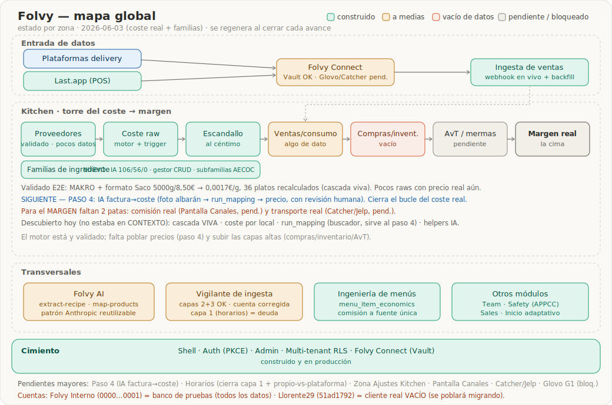

# Folvy — Mapa global

> **Qué es esto:** la vista de pájaro de Folvy por zonas y su estado real, para **decidir frentes con contexto completo**.
> Se regenera al cerrar cada avance (igual que `CONTEXTO_CLAUDE.md` §1). El diagrama es `folvy_mapa_global.svg` — SVG versionable (texto diffeable en git), **no** una imagen binaria.
>
> **Regla de oro:** este mapa se regenera DESDE la fuente primaria (BBDD + repo) tras un recon de área, **nunca** desde el relato del CONTEXTO. El CONTEXTO va por detrás; los errores componen.

**Última regeneración:** 2026-06-03 (cierre: frente coste real + familias de ingrediente completas)

---

## Cuentas (CRÍTICO — no confundir)
- **`Folvy Interno` (`0000…0001`) = BANCO DE PRUEBAS.** Todo el trabajo real vive aquí: 162 raws, 215 dishes, ~12K ventas, 55 familias de plato + 15 de ingrediente. Para Kitchen/coste, trabajar SIEMPRE aquí.
- **`Llorente29` (`51ad1792-…`) = CLIENTE REAL, hoy VACÍO.** Se poblará migrando desde Folvy Interno.
- **Futuro:** cuenta "cliente base" con semillas para onboarding.

---

## Leyenda de estado

- **construido** — hecho y, donde aplica, verificado en producción.
- **a medias** — parte hecha, parte pendiente (se detalla abajo).
- **vacío de datos** — la estructura existe (tablas/UI/funciones) pero no hay datos cargados; no produce valor hasta poblarlo.
- **pendiente / bloqueado** — no construido, o esperando algo externo.

---

## Zonas

### Entrada de datos
- **Plataformas delivery** — *bloqueado/parcial.* Hoy llegan vía Last.app. Integración directa: Glovo **bloqueado** esperando acceso al stage (ticket INTSUPPO-1382); Uber/JustEat por diseñar. Decisión estratégica: Folvy = integrador directo (ver CONTEXTO §1.0.ter).
- **Last.app (POS)** — *construido.* Webhook en vivo en producción, captura fiscal completa. Regla crítica: deploy SIEMPRE `--no-verify-jwt`.
- **Folvy Connect** — *a medias.* Modelo de conectores + pantallas + cifrado de credenciales con Vault (D2) hechos y verificados. Glovo sembrado pero bloqueado; Catcher esperando credenciales.
- **Ingesta de ventas** — *construido.* Las ventas entran solas (webhook), backfill histórico hecho.

### Kitchen · torre del coste → margen (frente vivo, ver CONTEXTO §1.1)
La cadena que convierte compra real en margen real. **El motor está construido y VALIDADO con dato real; falta cargar el combustible (precios de los 162 raws) y subir las capas altas.**
- **Proveedores / artículos / formato / precio** — *construido + validado E2E, vacío de datos.* Modelo completo (`supplier`, `article_supplier`, `recipe_item_purchase_format` anidado), UI v1 con lenguaje de cocinero, cálculo en vivo. **Validado hoy:** MAKRO + formato Saco 5000g/8,50€ → 0,0017€/g, "Desde la compra", 36 platos recalculados. Datos: pocos raws con precio real todavía.
- **Coste raw** — *construido + validado.* `kitchen_recompute_raw_cost` (last_price ÷ qty_in_base) + trigger automático. Una sola verdad (kitchen_recompute_item delega; reconciliado hoy, commit bc28560).
- **Escandallo (coste teórico)** — *construido.* Validado al céntimo. Invariante SUM(líneas)=computed_cost.
- **Familias de ingrediente** — *construido (NUEVO hoy).* `recipe_family` (scope dish|ingredient + jerarquía parent_family_id 2 niveles + accounting_category), 15 familias AECOC. Clasificación IA (map-products modo recipe_item→recipe_family, por tandas): 106 auto + 56 revisar, 0 sin familia. UI: revisión/aprobación, buscador, filtro, chip, gestor CRUD completo (crear/subfamilia/renombrar/archivar+reasignar/reordenar). Patrón IA-propone-humano-aprueba.
- **Ventas / consumo teórico** — *a medias.* Hay dato de ventas; el consumo teórico (ventas × escandallo) por explotar.
- **Compras / inventario** — *vacío.* `purchase`/`purchase_line` existen, sin datos.
- **AvT / mermas** — *pendiente.* Teórico vs real, ingrediente a ingrediente. Necesita compras + inventario poblados.
- **Margen real** — *pendiente (la cima).* Ver CONTEXTO §1.5. 3 patas: coste receta (en marcha) + comisión real (Pantalla Canales) + transporte real (Catcher/Jelp).

**Construido y que el CONTEXTO no registraba (descubierto hoy):** cascada de coste a platos (viva), coste por local (`kitchen_recipe_cost_by_location`), `location_economics`, `run_mapping` (BUSCADOR de ingredientes texto→recipe_item, sirve al paso 4), helpers IA de cocina, `materialize_recipe_session`, plantillas (`*_template`).

**Siguiente del frente — PASO 4 IA FACTURA→COSTE (el más ambicioso):** foto de albarán/factura → casar líneas con ingrediente (vía `run_mapping`) → actualizar precio en article_supplier, con revisión humana (hueco a ganar vs MarketMan/xtraCHEF, que no tienen capa de revisión nativa). Reúsa extract-recipe + map-products + run_mapping. Cierra el bucle del coste real.

### Transversales
- **Folvy AI** — *a medias.* Streaming SSE, tool-use, memoria, helpers de cocina. Edge Functions IA maduras: `extract-recipe` (visión foto→escandallo, Opus), `map-products` (mapeo + clasificación, Sonnet), `folvy-ai`. Patrón Anthropic montado, reutilizable. IA = prioridad transversal.
- **Vigilante de ingesta** — *a medias.* Capas 2+3 construidas y validadas (ping sintético cada 10 min + watchdog Healthchecks + canal `system-alert`). Config corregida hoy → apunta a `0000…0001` (cuenta real con ventas). Capa 1 (frescura por horario) = DEUDA enganchada al módulo de Horarios. Ver CONTEXTO §1.1.
- **Ingeniería de menús** — *construido.* `menu_item_economics`, comisión a fuente única (`brand_channel_rate`).
- **Otros módulos** — *construido.* Team, Safety (APPCC), Sales, inicio adaptativo, portal del trabajador.

### Cimiento
- **Shell · Auth (PKCE) · Admin · Multi-tenant RLS · Folvy Connect (Vault)** — *construido y en producción.* Arquitectura modular (añadir módulo = añadir línea en `moduleRegistry.ts`).

---

## Pendientes mayores (frentes futuros)
- **PASO 4 — IA factura→coste** — el siguiente del frente del coste; cierra el bucle proveedor→precio→escandallo→plato.
- **Horarios del cliente** — no existe. Prerrequisito de la Capa 1 del vigilante y de la decisión propio-vs-plataforma. ¿Vive en `brand` o en `location`?
- **Zona "Ajustes" en Kitchen** — agrupar configuraciones (familias/unidades/formatos/coste/IA). Disparador: ≥3 configuraciones. Hoy solo familias (config contextual en Ingredientes).
- **Pantalla Canales** — escritor de `brand_channel_rate` (comisión por marca×canal×reparto).
- **Transporte Catcher/Jelp** — integración pendiente; pata del margen real.
- **Catálogo estándar de onboarding** — semilla de ingredientes/familias (AECOC) para arrancar cliente nuevo. Las `*_template` ya existen.
- **Glovo G1** — recepción real de pedidos, bloqueado por ticket INTSUPPO-1382.
- **Mejora declarada** — en lista de "platos recalculados", pinchar un plato → navegar a su ficha (cablear navegación ingrediente→plato).
- **Vigencia temporal de tarifas** — `brand_channel_rate` sin válida-desde/hasta; decisión de modelo antes del motor de margen.
- **Deuda operativa** — rotar token Last (visible en chat) + service-role, code-splitting bundle (~682KB gzip), medidor de coste IA por cuenta (prerequisito 2º cliente).
