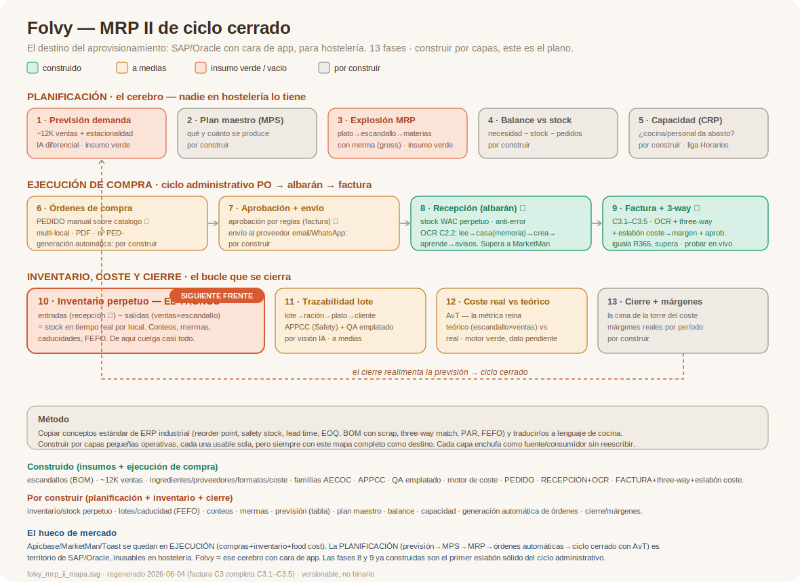

# Folvy — Mapa MRP II (destino del aprovisionamiento)

> **Qué es esto:** el destino completo del módulo de aprovisionamiento de Folvy, concebido como **MRP II de ciclo cerrado** de hostelería — un "SAP/Oracle con UI moderna que un cocinero usa sin manual". Es el plano del que cuelga cada pieza que se construya, para que ninguna se haga aislada y luego no encaje.
> Diagrama: `folvy_mrp_ii_mapa.svg` (SVG versionable, no imagen binaria).

**Creado:** 2026-06-03

---

## Decisión estratégica
El aprovisionamiento de Folvy **NO es "un módulo de compras"** — es **MRP II de ciclo cerrado**. El hueco de mercado para ganar: nadie en hostelería tiene la **PLANIFICACIÓN** (Apicbase, MarketMan, Toast se quedan en *ejecución*: compras + inventario + food cost). La planificación (previsión → plan maestro → explosión de necesidades → órdenes automáticas → ciclo cerrado con AvT) es territorio de SAP/Oracle, inusables en hostelería. Folvy = ese cerebro con cara de app.

**Método (clave):** copiar conceptos **estándar y probados de ERP industriales** (no inventar) y **traducirlos a lenguaje de cocina** para que sean manejables. Construir por **capas pequeñas operativas**, pero siempre con este mapa completo como destino.

---

## Las 13 fases del ciclo

### Planificación (el cerebro — nadie en hostelería lo tiene)
1. **Previsión de demanda** — *insumo verde.* Cuántos platos por servicio/día/local, desde el histórico (~12K ventas) + estacionalidad + eventos. IA diferencial.
2. **Plan maestro de producción (MPS)** — *por construir.* Qué y cuánto se produce.
3. **Explosión de necesidades (MRP)** — *insumo verde.* Cada plato → su escandallo (BOM) → materias primas. Con factor de merma (gross). El corazón del cálculo.
4. **Balance contra stock** — *por construir.* Necesidad − stock disponible − órdenes pendientes = lo que hay que comprar.
5. **Planificación de capacidad (CRP)** — *por construir.* ¿La cocina/personal da abasto? Vincula con Horarios y Team.

> Conceptos a traducir aquí (de ERP industrial): **PAR level** (= punto de reorden + stock de seguridad, con nombre que el cocinero entiende), **lead time** de proveedor, **lote económico**, **backward scheduling**. Fórmula MRP estándar: necesidad neta = (suministro + stock) − demanda − stock de seguridad.

### Ejecución de compra (ciclo administrativo estándar PO→albarán→factura)
6. **Generación de órdenes de compra** — *por construir.* Automática desde el balance (4), o por stock mínimo (PAR), plantilla de necesidades, o iniciativa. Agrupadas por proveedor preferente.
7. **Aprobación + envío** — *por construir.* Gating por presupuesto/rol → envío al proveedor (email/PDF/API/EDI).
8. **Recepción (albarán)** — *a medias / OCR pendiente.* Llega la mercancía → OCR lee el albarán → entra a stock. Modelo `purchase`/`purchase_line` existe pero sin ciclo.
9. **Factura + three-way match** — *a medias.* PO ↔ albarán ↔ factura cuadran; discrepancias cazadas (pediste 10, llegaron 9, te cobran 10). El control que de verdad protege al restaurador.

> **El flujo SIEMPRE es con pedido** (norma estándar en hostelería y cualquier sector). Los datos sueltos de Llorente29 (factura sin pedido) son caso de prueba, no el flujo principal. Casos límite a cubrir: artículo no existe → crear ingrediente; proveedor no existe → crear; sin pedido → validar por totales internos (excepción, no norma).

### Inventario, coste y cierre (el bucle que se cierra)
10. **Inventario perpetuo** — *por construir (EL TRONCO).* Entradas (recepción) − salidas (consumo por ventas×escandallo) = stock en tiempo real por local/almacén. Conteos, mermas, caducidades, **lotes con fecha (FEFO)**. Casi todo lo demás cuelga de aquí.
11. **Trazabilidad lote → ración → plato → cliente** — *a medias.* APPCC (en Safety) + `recipe_item_production_check` (QA emplatado por visión IA) ya existen como piezas.
12. **Coste real vs teórico (AvT)** — *motor verde, dato pendiente.* Teórico (escandallo×ventas) vs real (compras ± variación de inventario). La métrica reina. El motor de coste ya está; necesita el inventario poblado.
13. **Cierre por período + márgenes reales** — *por construir.* La cima de la torre del coste.

**El cierre realimenta la previsión** → ciclo cerrado.

---

## Estado: qué tiene Folvy ya (insumos verdes)
escandallos (BOM) · ~12K ventas (previsión) · ingredientes/proveedores/formatos/coste · familias AECOC · APPCC (trazabilidad) · `recipe_item_production_check` (QA emplatado) · motor de coste (→AvT) · `purchase`/`purchase_line` (documento suelto, a reconvertir en el ciclo).

## Qué está vacío (por construir)
inventario/stock perpetuo · movimientos de stock · lotes/caducidad (FEFO) · conteos · previsión (tabla) · plan maestro · balance · capacidad · órdenes de compra (PO) · recepción/albarán · mermas · almacenes.

## El tronco (probable primera capa)
**Inventario perpetuo (10) + el ciclo de compra que lo alimenta (6-9, donde encaja el OCR).** Sin inventario no hay balance (4), ni punto de reorden (5-6), ni AvT real (12), ni FEFO. Es la pieza de la que cuelga el ciclo cerrado. Decisión de por dónde empezar: pendiente.

## Conceptos del benchmark a traducir (referencia)
- **ERP industrial (SAP/Sage/Acumatica):** reorder point, safety stock, lead time, lot size / EOQ, BOM con scrap factor, backward scheduling, three-way match, purchase requisition (la propone MRP) ≠ purchase order (aprobada).
- **Perecedero (NetSuite/RELEX/Katana):** PAR level (Periodic Automatic Replenishment), FEFO (First Expired First Out), lotes con caducidad + alertas, auto-86 (quita del menú lo agotado, conecta con delivery), transferencias entre locales, conversión de unidades (granel→uso).
